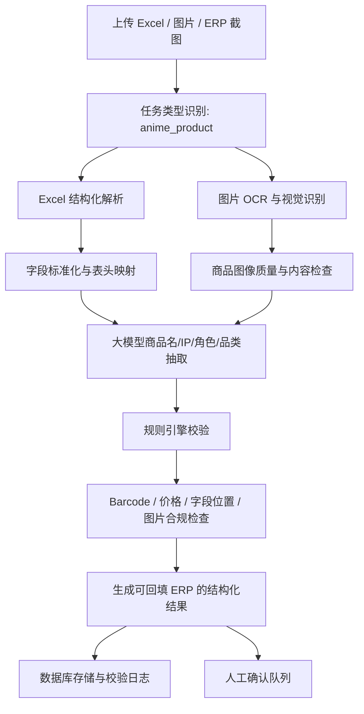

# 二次元商品识别与校验算法改进方案

## 1. 背景与目标

当前项目主要面向外贸发票、单证的精准识别、结构化存储、调用和合规校验，已经具备 OCR、大模型调用、数据库存储、SSE 进度回传和规则校验等基础能力。

本次改进建议不要替换原有外贸单证功能，而是在算法侧新增一个“二次元周边商品识别与校验”功能分支。该分支面向 SKU 极多、IP 和角色强绑定、中文商品名复杂、Excel 表格来源多、商品图片重要且价格字段涉及多个地区币种的业务场景。

目标是让系统能够对 ERP 中一行商品数据自动识别、提取、填入并完成校验，重点覆盖中文名提取、Excel 表格字段提取、商品图片检查、13 位 Barcode 校验、价格合规和字段位置合规。

## 2. 新功能定位

建议新增功能名称：二次元商品识别与校验 Agent。

建议定位如下：

- 保留原有 `invoice` 外贸发票/单证识别链路。
- 新增 `anime_product` 二次元商品资料处理链路。
- 两条链路共享 OCR、大模型调用、数据库、任务调度、SSE 状态回传等基础能力。
- 在算法层新增商品识别 schema、提示词、规则配置、词库和字段映射，不直接改写原有发票规则。
- 在数据库层新增商品资料表、商品图片表、校验日志表，或在现有任务表中通过 `doc_type` / `task_type` 区分。

## 3. 输入与输出范围

首期建议支持以下输入：

- Excel 文件：用于提取商品行、字段列、价格列和备注信息。
- 商品图片：用于识别条码、角色、IP、商品类型，并做图片合规检查。
- ERP 页面截图或单行商品截图：可作为后续扩展，不建议首期作为主输入。
- 用户补充文本：用于提供批次、供应商、IP 名称、定价规则等上下文。

输出建议按“每一行商品”生成结构化结果：

- 字段提取值。
- 字段置信度。
- 字段来源：Excel、OCR、图片识别、大模型推断、用户补充。
- ERP 字段映射建议。
- 合规检查结果。
- 需要人工确认的问题。
- 可写入数据库或回填 ERP 的最终数据。

## 4. 关键字段字典

| 字段 | 含义 | 主要来源 | 建议必填 | 初步校验规则 |
| --- | --- | --- | --- | --- |
| Barcode | 商品条码 | Excel / OCR / 图片条码识别 | 是 | 必须为 13 位数字；使用 EAN-13 校验位规则检查 |
| 商品Image | 商品图片 | 图片文件 / ERP 图床 / Excel 内嵌图 | 是 | 图片存在、可读取、清晰度足够、与商品行匹配 |
| Product Name (English) | 英文商品名 | Excel / 大模型翻译或规范化 | 建议必填 | 不应为空；命名格式需统一 |
| Product Name | 中文商品名 | Excel / OCR / 大模型提取 | 是 | 不应为空；需包含商品核心名称；可检查 IP、角色、品类关键词 |
| L1 | 商品大类 | Excel / 分类规则 / 大模型 | 是 | 必须命中预设大类枚举 |
| L2 | 商品具体种类 | Excel / 分类规则 / 大模型 | 是 | 必须命中 L1 下的合法子类 |
| IP | 作品或品牌 IP | 商品名 / 图片 / 知识库 | 是 | 必须命中 IP 词库或进入人工确认 |
| Character | 角色 | 商品名 / 图片 / 知识库 | 建议必填 | 必须属于对应 IP 的角色词库，未知时标记待确认 |
| Cabinet | 箱规 | Excel / OCR / 供应商资料 | 视业务而定 | 格式统一；数量必须为正数 |
| Remark | 特殊标记 | Excel / 用户文本 / 规则推断 | 可选 | 标记限量、预售、盲盒、特典、瑕疵、再版等特殊情况 |
| Cost-CN | 人民币成本单价 | Excel | 是 | 数值必须大于 0；保留小数规则统一 |
| DISC% | 折扣 | Excel / 计算得到 | 是 | 按“成本价 / 零售价”计算，需与 Cost-CN、SRP-CN 一致 |
| SRP-CN | 人民币零售单价 | Excel | 是 | 数值必须大于等于 Cost-CN，特殊折扣品除外 |
| TH | 泰铢零售价 | Excel / 定价规则计算 | 建议必填 | 数值必须大于 0；按币种定价规则校验 |
| MY | 马来西亚林吉特零售价 | Excel / 定价规则计算 | 建议必填 | 数值必须大于 0；按币种定价规则校验 |
| SG | 新加坡零售价 | Excel / 定价规则计算 | 建议必填 | 数值必须大于 0；按币种定价规则校验 |
| IND | 印度尼西亚零售价 | Excel / 定价规则计算 | 建议必填 | 数值必须大于 0；按币种定价规则校验 |

## 5. 算法能力改进设计

### 5.1 Excel 表格提取

Excel 提取应优先使用结构化解析，而不是 OCR。

建议能力：

- 使用 `openpyxl`、`pandas` 或类似库读取工作簿。
- 自动识别表头行。
- 支持多 sheet。
- 支持字段别名映射，例如 `Barcode`、`条码`、`商品条码`、`EAN`、`JAN`。
- 支持空行、合并单元格、隐藏列和格式化数字。
- 对 Barcode 强制按字符串处理，避免 Excel 将 13 位数字转为科学计数法或丢失前导零。

建议新增 `anime_product_header_aliases.json`，维护字段别名：

```json
{
  "Barcode": ["Barcode", "条码", "商品条码", "EAN", "JAN"],
  "Product Name": ["Product Name", "商品名", "中文名", "品名"],
  "Product Name (English)": ["Product Name (English)", "英文名", "English Name"],
  "L1": ["L1", "商品大类", "大类"],
  "L2": ["L2", "商品具体种类", "小类", "品类"],
  "IP": ["IP", "作品", "版权", "系列"],
  "Character": ["Character", "角色", "人物"],
  "Cabinet": ["Cabinet", "箱规", "装箱数"],
  "Remark": ["Remark", "备注", "特殊标记"],
  "Cost-CN": ["Cost-CN", "人民币成本单价", "成本价", "CN Cost"],
  "DISC%": ["DISC%", "折扣", "Discount"],
  "SRP-CN": ["SRP-CN", "人民币零售单价", "建议零售价", "CN SRP"],
  "TH": ["TH", "泰铢零售价", "泰国"],
  "MY": ["MY", "马来西亚林吉特零售价", "马来西亚"],
  "SG": ["SG", "新加坡零售价", "新加坡"],
  "IND": ["IND", "印度尼西亚零售价", "印尼"]
}
```

### 5.2 中文商品名、IP、角色、品类提取

中文商品名提取建议采用“规则 + 大模型 + 词库”的混合方式：

- 从 Excel 商品名、备注、图片 OCR 文本中提取候选中文名。
- 根据 IP 词库、角色词库、品类词库做实体识别。
- 使用大模型进行标准化命名，例如统一为“IP + 角色 + 商品类型 + 款式/规格”。
- 对盲盒、特典、再版、限定、预售等特殊词进行 `Remark` 标注。
- 对置信度低的结果输出“待人工确认”，不直接覆盖原字段。

建议输出格式示例：

```json
{
  "productName": "排球少年 日向翔阳 亚克力立牌",
  "ip": "排球少年",
  "character": "日向翔阳",
  "l1": "周边",
  "l2": "亚克力立牌",
  "remark": ["角色款", "需确认尺寸"],
  "confidence": 0.86,
  "source": ["excel.product_name", "image.ocr", "llm.normalize"]
}
```

### 5.3 图片识别与合规检查

商品图片建议拆分成三类检查：

- 文件级检查：图片是否存在、可打开、尺寸是否满足 ERP 要求、格式是否允许、是否重复。
- 质量检查：清晰度、是否过暗、是否水印过重、是否裁切严重、主体是否可见。
- 内容检查：是否能识别商品主体、IP/角色是否与文字字段一致、是否存在明显不相关图片。

首期可先做规则和轻量图像指标：图片尺寸、格式、文件大小、hash 去重、清晰度评分。第二阶段再接入视觉模型或多模态大模型，识别 IP、角色、商品类型候选。

### 5.4 Barcode 校验

Barcode 字段建议按 EAN-13 规则校验：

- 只允许 13 位数字。
- 禁止空格、短横线、科学计数法。
- 计算前 12 位的校验位，并与第 13 位比较。
- 同一批次内 Barcode 不应重复。
- Barcode 与商品图片中的条码识别结果不一致时标记为高风险。

EAN-13 校验位规则：

1. 从左到右取前 12 位。
2. 奇数位求和，偶数位求和乘以 3。
3. 两者相加后取模 10。
4. 校验位为 `(10 - mod) % 10`。

### 5.5 价格与数量合规

建议新增价格规则：

- `Cost-CN` 必须大于 0。
- `SRP-CN` 必须大于 0。
- 默认 `SRP-CN >= Cost-CN`，特殊折扣品可通过 `Remark` 放行。
- `DISC%` 应等于 `Cost-CN / SRP-CN`，可允许 0.5% 左右误差。
- `TH`、`MY`、`SG`、`IND` 必须为正数。
- 多币种价格按固定倍率、汇率、地区定价表或 ERP 价格表校验。
- 出现 0、负数、空值、异常高价、异常低价时标记风险。
- `Cabinet` 如果表示箱规数量，必须为正整数或符合业务格式。

这里需要你确认：`DISC%` 当前定义为“成本价 / 零售价”。如果 ERP 中实际表示折扣率、毛利折扣或供应商折扣编码，需要统一公式，否则会误报。

### 5.6 IP 与 Character 校验

建议建立基础知识库：

- IP 词库：中文名、英文名、日文名、别名。
- Character 词库：角色中文名、英文名、日文名、别名、所属 IP。
- 商品品类词库：L1、L2 枚举和映射关系。
- 禁用词/高风险词：盗版、非授权、无版权、仿制、敏感词等。

校验规则：

- Character 必须属于对应 IP。
- Product Name 中识别出的 IP 与 IP 字段应一致。
- Product Name 中识别出的 Character 与 Character 字段应一致。
- 图片识别出的 IP/Character 与文本字段冲突时标记待确认。
- 未命中词库但大模型推断置信度较高时，标记为“新增候选词”，进入人工审核。

## 6. 推荐处理流程



## 7. 数据库与存储建议

建议新增或扩展 `product_items` 表，用于保存商品主数据：

- `id`
- `task_id`
- `barcode`
- `image_url` 或 `image_path`
- `product_name_en`
- `product_name_cn`
- `l1`
- `l2`
- `ip`
- `character`
- `cabinet`
- `remark`
- `cost_cn`
- `disc_percent`
- `srp_cn`
- `th_price`
- `my_price`
- `sg_price`
- `ind_price`
- `confidence`
- `status`
- `created_at`
- `updated_at`

建议新增 `product_validation_logs` 表，用于保存每条校验记录：

- `id`
- `product_item_id`
- `rule_id`
- `rule_type`
- `field_name`
- `severity`
- `is_passed`
- `message`
- `source_value`
- `expected_value`
- `created_at`

建议新增 `product_knowledge_base` 表，用于保存 IP、角色、品类和别名：

- `id`
- `entity_type`: ip、character、category_l1、category_l2、alias
- `canonical_name`
- `alias_name`
- `parent_id`
- `language`
- `status`
- `created_at`

## 8. API 与算法服务改造建议

建议新增或扩展接口：

- `POST /api/product/upload-excel`: 上传商品 Excel。
- `POST /api/product/upload-image`: 上传商品图片。
- `POST /api/product/analyze`: 启动商品识别任务。
- `GET /api/product/{task_id}/results`: 获取识别结果。
- `POST /api/product/{task_id}/confirm`: 提交人工确认修正。
- `GET /api/product/{task_id}/stream`: SSE 回传商品处理进度。

算法服务建议新增模块：

- `anime_product_excel_parser.py`: Excel 表格解析。
- `anime_product_extractor.py`: 商品字段抽取与标准化。
- `anime_product_validator.py`: 商品字段与价格规则校验。
- `anime_product_vision.py`: 图片质量与内容识别。
- `anime_product_rules.json`: 商品规则配置。
- `anime_product_schema.json`: 字段 schema 与输出格式。

## 9. 合规检查规则分级

建议将问题分成三个等级：

- `error`: 必须修复，否则不能写入 ERP。
- `warning`: 建议人工确认，但允许暂存。
- `info`: 仅提示或记录，不阻断。

首期 `error` 规则建议：

- Barcode 为空。
- Barcode 不是 13 位数字。
- Barcode EAN-13 校验失败。
- Product Name 为空。
- L1 或 L2 为空。
- Cost-CN、SRP-CN 为空或小于等于 0。
- 商品图片缺失或无法读取。
- 同一批次 Barcode 重复。

首期 `warning` 规则建议：

- IP 未命中词库。
- Character 未命中词库。
- Character 与 IP 关系不确定。
- DISC% 与 Cost-CN / SRP-CN 计算结果不一致。
- TH、MY、SG、IND 与预设换算规则偏差过大。
- 图片清晰度较低。
- Remark 中含有需要人工确认的特殊标记。

## 10. 分阶段实施计划

### 第一阶段：Excel 结构化提取与 Barcode 校验

- 新增 `anime_product` 任务类型。
- 完成 Excel 表头识别、字段映射、逐行提取。
- 完成 Barcode 13 位与 EAN-13 校验。
- 完成价格基础数值校验。
- 输出结构化 JSON 和校验日志。

### 第二阶段：商品名、IP、角色、品类抽取

- 建立 IP、角色、L1、L2 初版词库。
- 用大模型进行中文商品名标准化。
- 输出字段置信度和待确认项。
- 支持人工修正后写回知识库候选表。

### 第三阶段：商品图片识别与图片合规

- 支持商品图片上传、匹配和存储。
- 完成图片尺寸、格式、清晰度、重复图检查。
- 接入视觉模型或多模态大模型识别 IP、角色、商品类型。
- 与 Excel 文本字段做一致性校验。

### 第四阶段：ERP 回填与批量审核

- 增加 ERP 字段映射配置。
- 支持批量生成可导入 ERP 的 Excel。
- 支持只回填低风险字段，高风险字段进入人工确认队列。
- 建立审核日志，便于追溯模型与人工修改记录。

## 11. 我建议你补充确认的问题

为了把方案变成可实施的需求文档，我建议你确认以下问题：

1. 你现在 ERP 的数据导入方式是什么？是直接导入 Excel、调用 ERP API，还是人工复制粘贴到页面？
2. Excel 的固定模板是否已经存在？如果存在，字段列名、sheet 名、表头行是否稳定？
3. 商品图片现在如何存储？是在 Excel 内嵌、文件夹按条码命名、ERP 图床链接，还是由供应商单独提供？
4. Barcode 是 EAN-13，还是也可能出现 JAN、UPC、ISBN 或供应商内部码？
5. DISC% 公式是否确定为 `Cost-CN / SRP-CN`？ERP 中显示为小数、百分比，还是某种折扣编码？
6. TH、MY、SG、IND 的价格是人工维护，还是应根据 SRP-CN 按汇率或倍率自动计算？
7. 多币种价格是否有固定尾数规则？例如必须以 0、5、9、.90、.99 结尾。
8. L1 和 L2 是否已有标准枚举？如果没有，是否要先建立一版商品分类表？
9. IP 和 Character 是否有现成主数据？是否需要支持中文、英文、日文、别名、简称？
10. Character 是否允许为空？例如 logo 款、场景款、团体款、随机款应如何处理？
11. Remark 需要识别哪些特殊标记？例如盲盒、特典、限定、再版、预售、现货、瑕疵、无版权、供应商备注。
12. 图片合规的最低要求是什么？例如尺寸、背景、主体占比、是否允许水印、是否允许拼图。
13. 系统是否需要识别盗版或授权风险？如果需要，是否有授权 IP 清单或供应商白名单？
14. 单次批量处理大概是多少行 SKU？100、1000、10000 行会影响算法和队列设计。
15. 识别策略更偏向“尽量自动填满”，还是“宁可少填也不误填”？
16. 人工确认后的修正是否要反哺词库和规则库？
17. 最终输出更希望是“直接写入 ERP”，还是先生成一个审核后的 Excel？
18. 是否需要保留原始 Excel、图片、识别中间结果和每条规则的校验日志用于审计？

## 12. 需要优先拍板的最小问题集

如果要开始第一版开发，我建议优先确认这 6 个问题：

1. 你能否提供一份真实或脱敏后的 ERP 商品 Excel 模板？
2. 你能否提供 20 到 50 行真实或脱敏样例数据，包含正常、缺字段、价格异常、条码异常的情况？
3. Barcode 是否只按 EAN-13 校验？
4. L1、L2、IP、Character 是否已有标准词库？
5. 多币种价格的计算或校验规则是什么？
6. 首期结果是生成可导入 ERP 的 Excel，还是直接对接 ERP API？

## 13. 初步结论

该需求适合做成新增算法功能分支，而不是改造或替换原有外贸发票功能。最稳妥的路线是先完成 Excel 结构化提取、字段映射、Barcode 与价格规则校验，再逐步加入 IP/角色词库、大模型商品名标准化、图片识别和 ERP 回填。

首期交付应避免过度依赖图片和大模型推断，优先把结构化 Excel 解析、13 位条码、价格计算和字段完整性做稳定。这样可以尽快在真实 ERP 工作流中产生价值，同时把不确定的 IP、角色、图片判断放入人工确认队列，降低误填风险。
